<p align="left">
    <a aria-label="Translation" href="./README_RU.md">
        
    </a>
</p>

# Energy-Efficient Keyword Spotting for Battery-Powered IoT Devices

Bachelor's thesis, ITMO University, February to June 2026. Defended with honors.

A voice-controlled IoT device has to listen continuously, and continuous
listening fights the battery. This work cuts the average power of a keyword
spotting system by **530x** by splitting detection into a cascade of stages and
running a quantized neural network only when the cheaper stages have already
fired.

Everything here is measured on real hardware, not simulated: a dedicated bench
with two electrically separate power domains records current at microamp
resolution while the device under test runs the full cycle.


https://github.com/user-attachments/assets/e8ce2f0d-9088-42ab-9b9f-c59ab210a2dc


## Presentation Highlights

|  |
| --------------------------------------------- |

<p align="left">
  <a href="./thesis_defense_slides_RU.pdf">
    <b>View the full presentation (PDF, Russian)</b>
  </a>
  &nbsp;·&nbsp;
  <a href="./thesis_text_RU.pdf">
    <b>Full thesis text (PDF, Russian)</b>
  </a>
</p>

## Contents

- [Results](#results)
- [The problem](#the-problem)
- [Cascade architecture](#cascade-architecture)
- [Choosing the model](#choosing-the-model)
- [PTQ or QAT](#ptq-or-qat)
- [Measurement bench](#measurement-bench)
- [Where the energy actually goes](#where-the-energy-actually-goes)
- [Battery life](#battery-life)
- [Contribution](#contribution)
- [Repository structure](#repository-structure)
- [Related repositories](#related-repositories)

## Results

Five quantitative criteria were fixed before the work started. All five were
met.

| #   | Criterion                          | Target    | Result      |
| --- | ---------------------------------- | --------- | ----------- |
| C1  | Recognition accuracy (MLPerf Tiny) | >= 90 %   | **96.12 %** |
| C2  | Model size, internal SRAM          | <= 128 KB | **101 KB**  |
| C3  | Accuracy lost to INT8 quantization | <= 1 pp   | **-0.3 pp** |
| C4  | Inference latency on device        | <= 500 ms | **460 ms**  |
| C5  | Average power reduction            | >= 100x   | **530x**    |

> [!NOTE] C3 is negative because the INT8 model scored slightly **higher** than
> the FP32 one. That is a regularization effect, and the difference sits inside
> the Wilson confidence interval of the test set, so the honest reading is
> "quantization costs nothing here", not "quantization helps".

## The problem

Voice control is becoming standard for wearables, smart home devices and
industrial sensors. All of them run on a battery, which means recognition has to
happen locally: sending audio to the cloud burns the radio, adds latency, and
hands voice data to someone else.

But local recognition means the device listens to the audio stream all the time,
and that puts continuous microphone and CPU activity directly against a fixed
energy budget.

That conflict is what this work resolves.

## Cascade architecture

Detection is split into three stages of increasing cost. Only the stage that is
needed right now stays powered, and each stage wakes the next one by event.

| 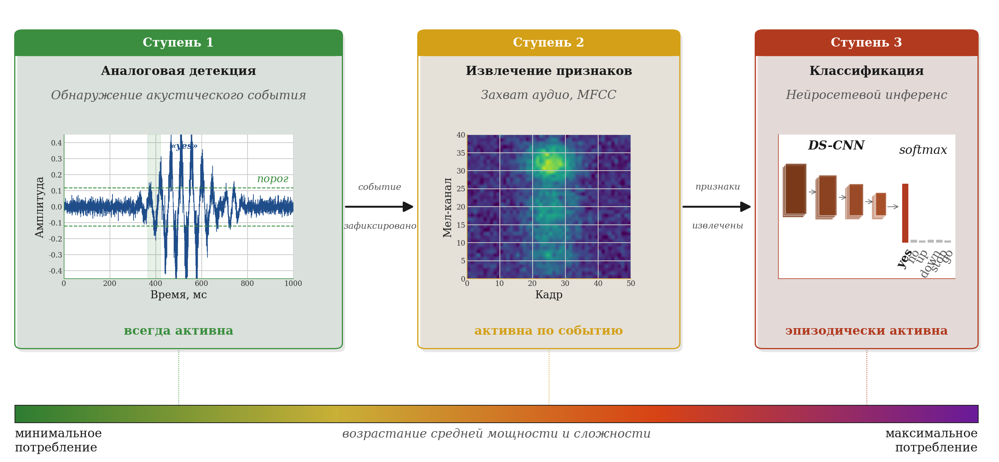 |
| ---------------------------------------------------- |


| Stage | What it does                              | Duty cycle             | Cost   |
| ----- | ----------------------------------------- | ---------------------- | ------ |
| 1     | Sound event detection, analog comparator  | always on              | lowest |
| 2     | Audio capture and MFCC feature extraction | fractions of a percent | medium |
| 3     | DS-CNN classification of the command      | fractions of a percent | high   |

The state machine below is what actually runs on the device. Every transition
and every current level in it was measured, not estimated.

| 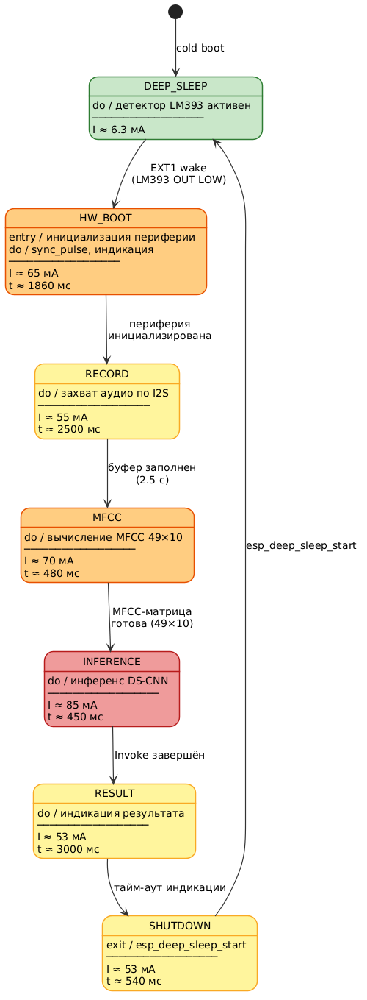 |
| ---------------------------------------------------------------------------------- |

The architecture is not tied to the platform. It applies to any microcontroller
with deep sleep and an external wake source.

**Feature extraction.** Audio arrives over I2S at 16 kHz and becomes a 49x10
MFCC matrix.

| 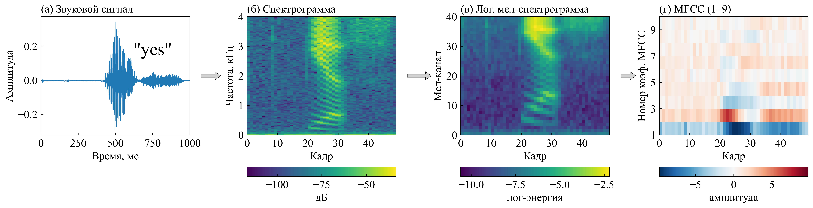 |
| ------------------------------------------------------------------------- |

## Choosing the model

Rather than taking the reference model from the literature, the whole design
space was swept: **134 models, 239 measured points** across a grid of filter
counts and blocks, each trained, quantized and evaluated.

| 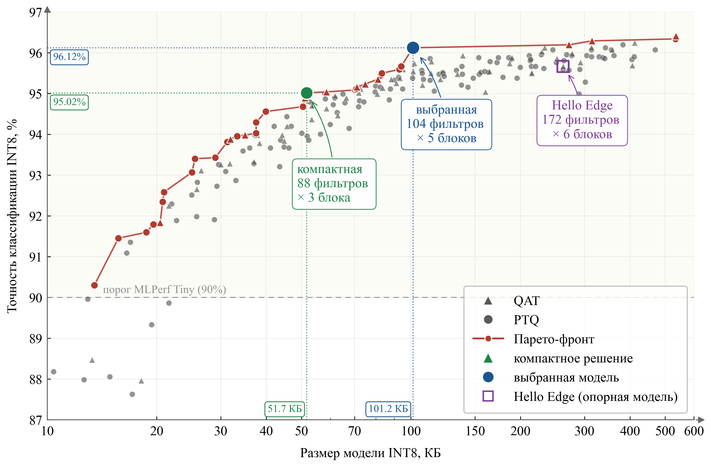 | 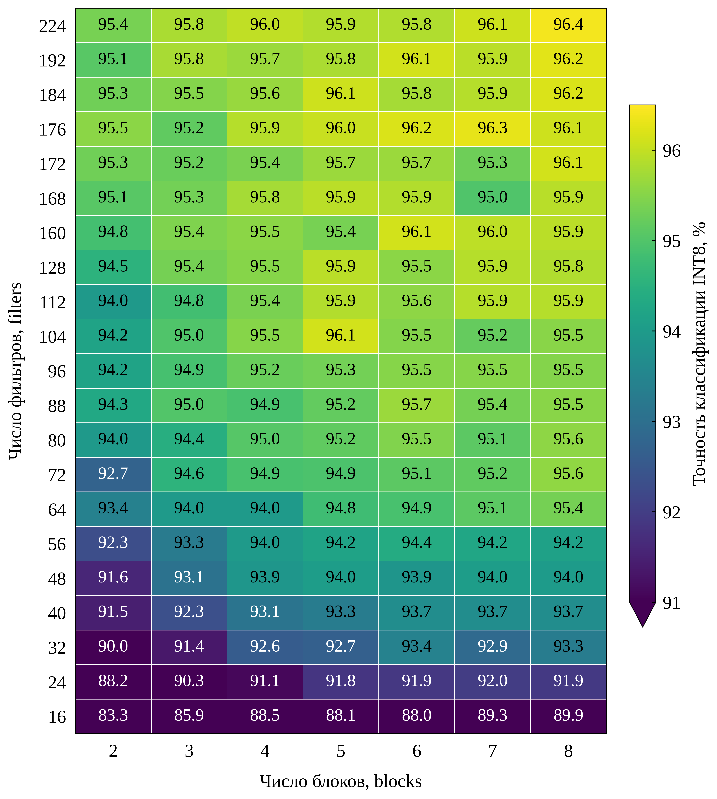 |
| --------------------------------------------------------------------------- | ---------------------------------------------------------------------------------------------- |

_Left: INT8 model size in KB against classification accuracy, with the Pareto
front in red. Right: accuracy over the filters (vertical) by blocks (horizontal)
grid._

The main finding: **the reference model from the literature does not lie on the
Pareto front.** Hello Edge (172 filters, 6 blocks) is beaten on both axes at
once. At the knee of the front, around 100 KB, extra accuracy gets expensive
fast.

Selected architecture: **104 filters, 5 blocks, 101.2 KB, 96.12 % accuracy.**

Adding energy to the picture confirms the choice:

| 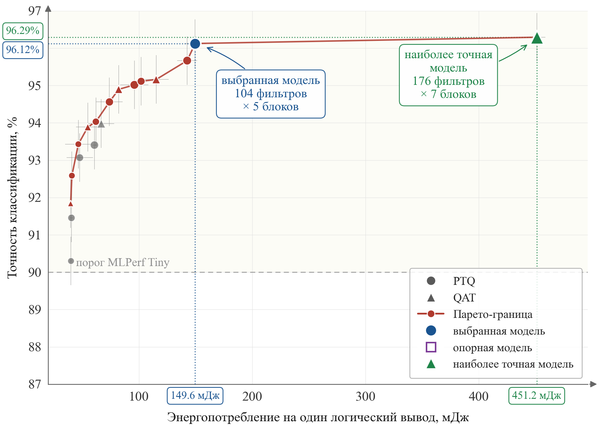 |
| -------------------------------------------------------------------------- |

_Energy per single inference in mJ against accuracy._

The most accurate architecture in the sweep (176 filters, 7 blocks) buys **0.17
percentage points** of accuracy for **3x the energy**: 451.2 mJ against 149.6
mJ. That is not a trade worth making on a battery.

## PTQ or QAT

Post-training quantization is simpler; quantization-aware training is assumed to
be more accurate. Both were run on **63 architectures** and compared.

| 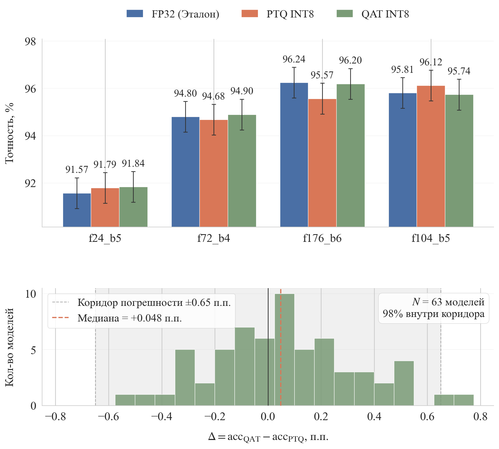 |
| --------------------------------------------------------- |

Median difference: **+0.05 pp**. 98 % of models fall inside a +-0.65 pp
corridor, which is the Wilson confidence interval of the test set itself.

> [!IMPORTANT] For INT8 on DS-CNN keyword spotting, QAT buys nothing measurable.
> PTQ was selected: same accuracy, far less work to deploy. This conclusion is
> deliberately narrow. At 4 or 2 bits, or on attention architectures, the
> literature shows QAT does pay off.

## Measurement bench

The system runs on an ESP32-S3. Measuring it required a bench where the
instrument cannot contaminate the measurement, so the two halves have
**electrically separate power domains**: the device under test on one battery,
the current sensor and logger on another.

| 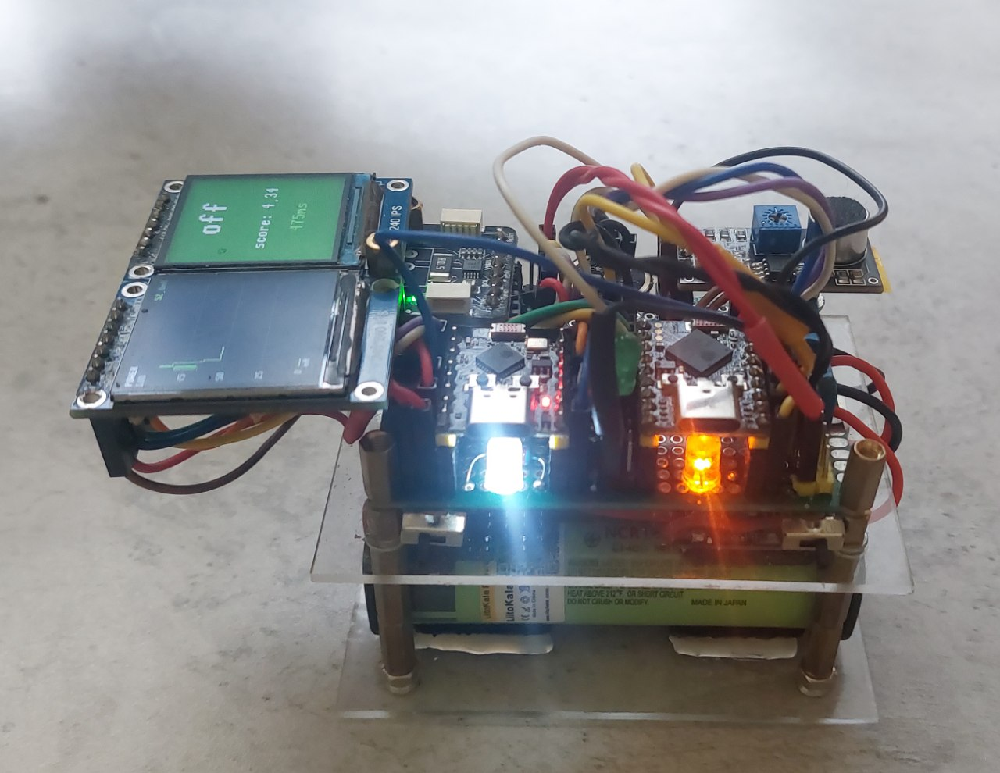 |
| -------------------------------------------------------------------- |

- Current sensor: **INA228**, 15 mOhm shunt, one LSB is about 2.6 uA, hardware
  averaging brings the resolution down to roughly 1 uA
- Deep sleep on the dev board measures 6.2 mA, active phases 49 to 83 mA, so the
  resolution is far more than enough to separate them
- Cascade phase boundaries are marked by a dedicated GPIO line synchronized with
  the logger, so intervals are unambiguous rather than inferred
- Every cycle was measured three times; the standard deviation is reported

| 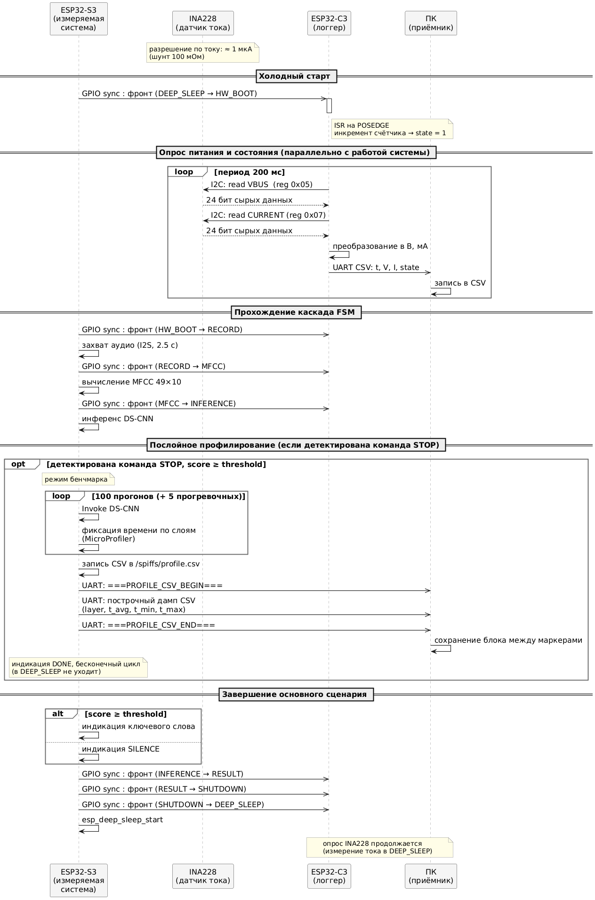 |
| --------------------------------------------------------------------------------- |

## Where the energy actually goes

This is the main research result.

| 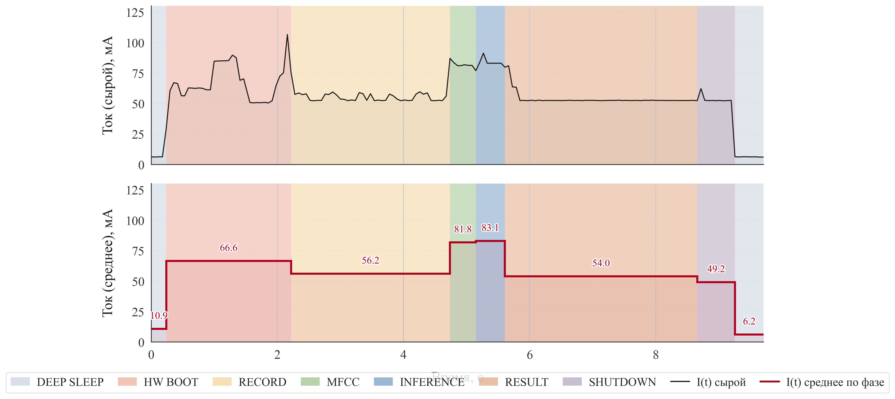 |
| ------------------------------------------------------------------------------------------ |

_Instantaneous current over one full command cycle (top) and the average per
phase (bottom)._

One complete cycle costs **1525.4 mJ over 5968 ms**:

| Phase                   | Duration, ms | Energy, mJ | Share  |
| ----------------------- | ------------ | ---------- | ------ |
| Hardware init (HW_BOOT) | 1982         | 532.57     | 34.9 % |
| Audio capture (RECORD)  | 2519         | 569.74     | 37.4 % |
| MFCC extraction         | 410          | 137.19     | 9.0 %  |
| DS-CNN inference        | 460          | 155.65     | 10.2 % |
| Shutdown to sleep       | 597          | 130.21     | 8.5 %  |
| **Total**               | **5968**     | **1525.4** | 100 %  |

| 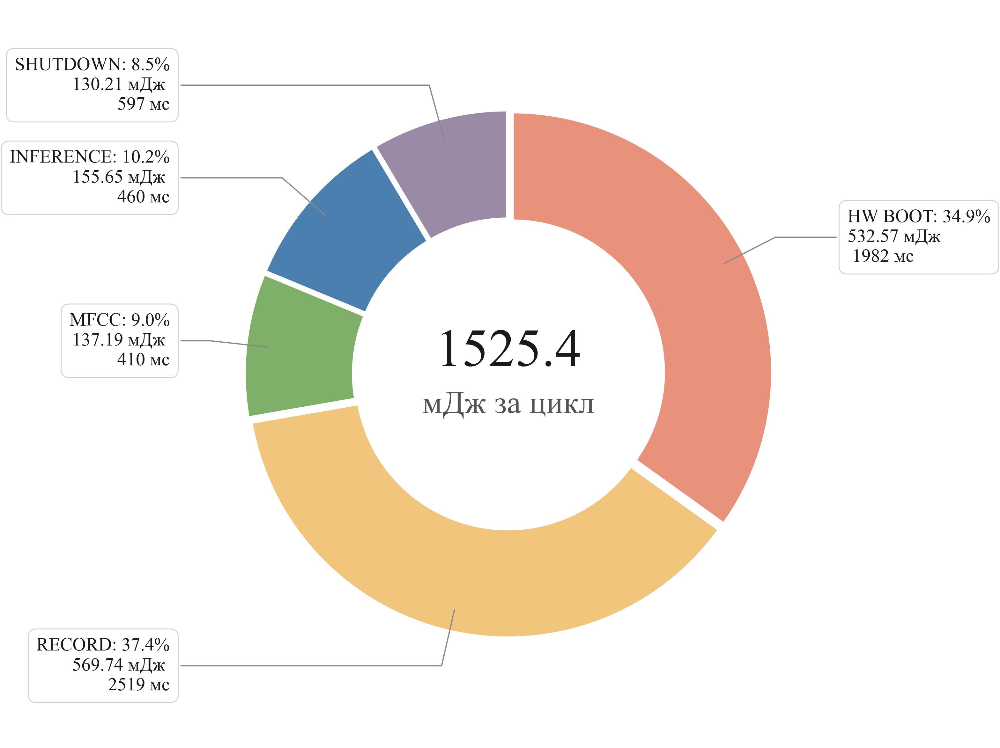 |
| --------------------------------------------------------------------------------------- |

> [!IMPORTANT] **Computation is 19.2 % of the cycle. Service phases are 80.8
> %.**
>
> The literature on always-on monitoring treats computation as the dominant
> consumer. In a cascaded system, where inference is episodic, the cost moves to
> hardware initialization, audio capture and the transitions between power
> modes. Peak current comes from the short compute phases, but the energy comes
> from the long service ones.
>
> That inverts the optimization priorities: shaving another 20 % off the
> inference kernel is worth 2 % of the cycle, while cutting the 1982 ms boot is
> worth ten times more.

## Battery life

With the cycle energy known, autonomy follows directly. Battery: a standard 2500
mAh 18650 cell.

| 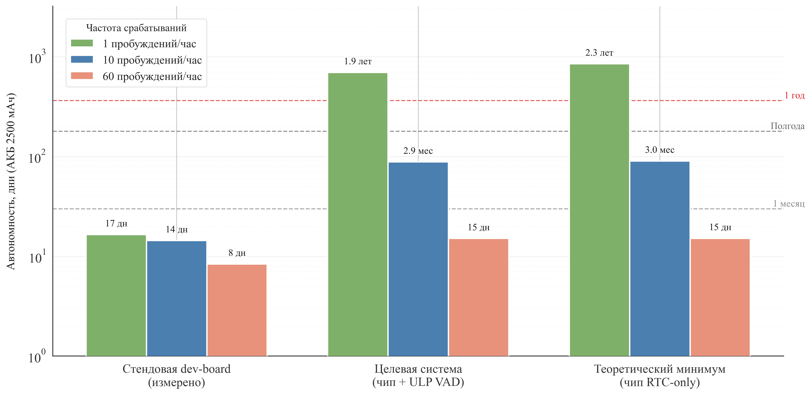 |
| --------------------------------------------------------------- |

| Wake-ups per hour | Dev board (measured) | Target board (projected) |
| ----------------- | -------------------- | ------------------------ |
| 1                 | 17 days              | **1.9 years**            |
| 10                | 14 days              | 2.9 months               |
| 60                | 8 days               | 15 days                  |

On the development board autonomy is not limited by the processing cycle at all.
It is limited by the board itself: the ESP32-S3 die draws around 10 uA in deep
sleep, while the regulator, USB bridge and LEDs around it draw 6.2 mA, a
thousand times more. Removing that overhead on a purpose-built board is where
the 40x jump comes from, not from any change to the algorithm.

Projected standby budget for such a board: about 30 uA total, made of the die
(~10 uA), an ultra-low-quiescent LDO (~4 uA), a wake-on-sound MEMS microphone
(~10 uA), leakage (~5 uA), with the INMP441 fully powered down through a MOSFET
switch.

## Contribution

1. **Systematic architecture search instead of a borrowed reference.** 134
   models, 239 measured points, results reported against the Wilson confidence
   interval of the test set. The commonly cited reference architecture turns out
   not to be on the Pareto front.

2. **Component-level energy decomposition of a cascade cycle.** Measured, not
   modelled. It shows service phases dominating computation, which contradicts
   the assumption carried over from always-on monitoring systems and redirects
   where optimization effort should go.

3. **PTQ against QAT on a statistically meaningful sample.** 63 architectures,
   median difference +0.05 pp, 98 % inside the measurement's own confidence
   interval. For INT8 DS-CNN keyword spotting the simpler method is sufficient.

Everything is reproducible: the dataset is Google Speech Commands v2, the
training, quantization, firmware and measurement processing code is published,
and the reference point is the MLPerf Tiny benchmark.

## Repository structure

```
thesis/                          LaTeX source of the thesis
  assets/diagrams/               figures and charts
  assets/plots/                  Pareto fronts, learning curves
  assets/tables/                 result tables
  assets/images/                 bench photographs, structural diagrams
  lib/                           referenced papers
edge-ai-voice-recognition/       submodule: ESP32-S3 firmware
precise-power-logger/            submodule: measurement logger firmware
itmo-industrial-practise-report/ industrial practice report
pre-graduation-practise/         pre-graduation practice
thesis_text_RU.pdf               full thesis, Russian
thesis_defense_slides_RU.pdf     defense slides, Russian
```

## Related repositories

- [**edge-ai-voice-recognition**](https://github.com/worthant/edge-ai-voice-recognition)
  ESP32-S3 firmware: I2S capture, MFCC in C, DS-CNN inference on TFLite Micro
  with Xtensa SIMD, the cascade state machine, and the training and quantization
  pipeline in Python.
- [**precise-power-logger**](https://github.com/worthant/precise-power-logger)
  Firmware for the logging domain: INA228 readout and synchronization with the
  device under test.

## Documents

- [Thesis text, Russian (PDF)](./thesis_text_RU.pdf)
- [Defense slides, Russian (PDF)](./thesis_defense_slides_RU.pdf)

Supervisor: Sergey Bykovsky, ITMO University. Contact:
[boris0indeed@gmail.com](mailto:boris0indeed@gmail.com), telegram
[@worthant](https://t.me/worthant).
