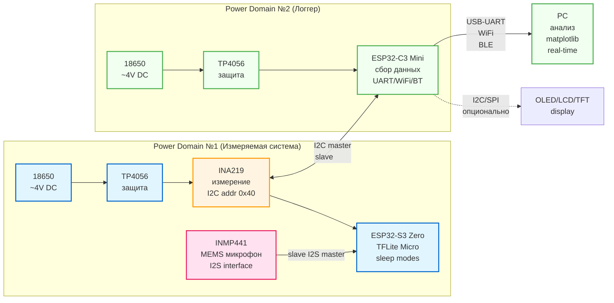

## Зачем этот репозиторий

- Пишу дипломную работу бакалавриата ИТМО.
- **Тема**: "Разработка энергоэффективной системы распознавания речи с
  использованием нейронных сетей для IoT-устройств".

## Проблематика

IoT-устройства с голосовым управлением (умные колонки, наушники, датчики)
работают от батарей/аккумуляторов и должны функционировать `месяцами` без
подзарядки. НО: распознавание речи и использование нейронок - очень
энергозатратная задача.

**Традиционное решение**: отправляем аудио-данные в облако (Google Assistant,
Alexa, Яндекс Cloud)

Всё бы хорошо, но:

1. Нужен постоянный интернет
2. Есть задержки на приём и отправку
3. Приватность??

**Edge AI**: решение запускать нейросеть прямо на устройстве, при этом
балансируя производительность так, чтоб батарейка не села в первый же день.

Об этом я и пишу диплом :)

## Цель работы

1. Создать прототип системы распознавания речи на MCU и измерить реальное
   потребление в разных этапах работы нейросети.
2. Оптимизировать потребление с помощью различных режимов сна и квантизации
   моделей.

## Выбор платформы

Для создания прототипа я рассматривал несколько популярных платформ для edge AI:

- **Arduino Nano 33 BLE Sense** — есть встроенный микрофон, но слабый CPU (64
  MHz Cortex-M4, 256 KB RAM)
- **STM32H7** — мощный процессор (480 MHz), но дорогой (~$15) и нет готовых AI
  библиотек
- **Raspberry Pi Pico** — дешёвый ($4), но маловато RAM (264 KB) для AI моделей
- **Nordic nRF52840** — отличный low power, но RAM 256 KB недостаточно для
  моделей 200-300 KB
- **Espressif ESP32-S3** — оптимальный баланс
  производительность/память/цена/экосистема

По итогу остановился на **ESP32-S3** и вот почему:

1. **Векторные инструкции (SIMD)**: Архитектура Xtensa LX7 с поддержкой SIMD
   (Single Instruction, Multiple Data). За один раз можно обработать несколько
   чисел => быстрее инференс нейросети.

2. **Достаточно памяти**: 512 KB SRAM -- как раз для стандартных моделей keyword
   spotting (200-300 KB) + аудио буферы.

3. **Периферия для аудио**: Аппаратный I2S контроллер для прямого подключения
   MEMS микрофонов без внешних кодеков.

4. **Энергоэффективность**: Несколько режимов сна с разным энергопотреблением:

   - Активный режим: ~40-80 mA (ИИ инференс)
   - Лёгкий сон: ~0.8 mA (CPU остановлен, можно проснуться по таймеру)
   - Глубокий сон: ~10 µA (только RTC, просыпаемся на GPIO)

5. **Цена и доступность**: ~$3-5 за чип, есть в наличии на
   Ozon/Wb/Яндекс.маркет, и во многих магазинах радиодеталей в городе.

6. **Экосистема**: ESP-IDF фреймворк + ESP-DL с готовыми квантизированными
   моделями для edge AI (keyword spotting, speech commands). Не нужно с нуля
   портировать TFLite.

**Примечание**: Хотя ESP32-S3 имеет WiFi/BLE, в измеряемой системе они отключены
для чистоты эксперимента. Связь только через INA219 <-> ESP32-C3 логгер.

## Прототип v1.0

### Компоненты

#### Power Domain #1 (измеряемая система)

- **18650 Li-ion** (2000 mAh) — автономное питание
- **TP4056** — контроллер заряда с защитой
- **INA219** — высокоточный датчик тока/напряжения (±3.2A, 12-bit ADC)
- **ESP32-S3 Zero** — микроконтроллер с AI моделью
- **INMP441** — MEMS микрофон (I2S, 16kHz sampling)

#### Power Domain #2 (система логирования)

- **18650 Li-ion** + **TP4056** — отдельное питание для изоляции помех
- **ESP32-C3 Mini** — сбор данных с INA219 по I2C
- Передача на ПК через USB-UART/WiFi/BLE
- Опционально: вывод аналитики по собранным данным в реальном времени на дисплей

#### Зачем раздельное питание?

ESP32-C3 при работе WiFi создаёт импульсные помехи до 300 mA. Если обе платы на
одной батарее → измерения INA219 будут зашумлены этими скачками.

### TODO

- [x] Выбор аппаратной платформы
- [x] Проектирование схемы измерения
- [ ] Прототипирование на breadboard (60% done)
- [ ] Firmware ESP32-S3 (TFLite integration)
- [ ] Firmware ESP32-C3 (INA219 logger)
- [ ] Сбор датасета измерений
- [ ] Анализ и оптимизация
