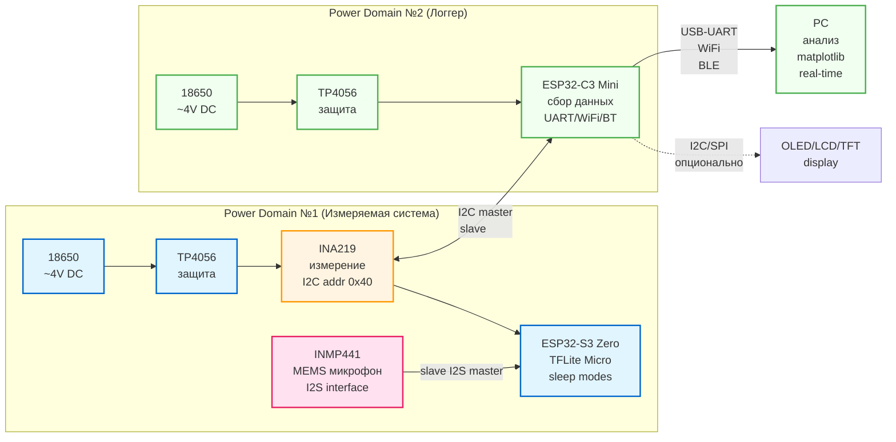

## Зачем этот репозиторий

- Пишу дипломную работу бакалавриата ИТМО.
- **Тема**: "Разработка энергоэффективной системы распознавания речи с
  использованием нейронных сетей для IoT-устройств".
- **Период**: "Февраль-Июнь 2026"

## Содержание

- [Проблематика](#проблематика)
- [Цель и задачи](#цель-и-задачи)
- [Выбор платформы](#выбор-платформы)
- [Архитектура прототипа](#архитектура-прототипа)
- [Текущий прогресс](#текущий-прогресс)
- [План работ](#план-работ)
- [Ожидаемые результаты](#ожидаемые-результаты)
- [Структура репозитория](#структура-репозитория)
- [Документация](#документация)

## Проблематика

IoT-устройства с голосовым управлением (умные колонки, наушники, датчики)
работают от батарей/аккумуляторов и должны функционировать `месяцами` без
подзарядки. НО: распознавание речи и использование нейронок - очень
энергозатратная задача.

**Традиционное решение**: отправляем аудио-данные в облако (Google Assistant,
Alexa, Яндекс Cloud)

Всё бы хорошо, но:

1. Нужен постоянный интернет
2. Есть задержки на приём и отправку
3. Приватность??
4. Энергопотребление wifi

**Edge AI**: решение запускать нейросеть прямо на устройстве, при этом
балансируя производительность так, чтоб батарейка не села в первый же день.

> [!NOTE]  
> конечно же не всё так гладко: как это сделать слабом железе на mcu, и
> обеспечить **месяцы** автономной работы при постоянном распознавании речи?

Об этом я и пишу диплом :)

## Цель и задачи

### Цель работы

```
Разработать прототип системы распознавания речи
 для IoT-устройств
 на базе микроконтроллера ESP32-S3
 и снизить энергопотребление
 за счёт использования квантизированных нейронных сетей
 и оптимизации режимов работы
 с экспериментальной оценкой достигнутых результатов.
```

### Задачи

1. **Провести анализ** существующих решений для распознавания речи на
   edge-устройствах и методов оптимизации энергопотребления

2. **Спроектировать и собрать** измерительный стенд с раздельными доменами
   питания для точного измерения энергопотребления системы распознавания речи

3. **Разработать прошивку** для ESP32-S3 с интеграцией MEMS микрофона (I2S) и
   квантизированных моделей нейронных сетей (ESP-SR WakeNet9)

4. **Разработать систему логирования** данных энергопотребления на базе ESP32-C3
   и датчика INA219 с передачей на ПК для анализа

5. **Провести экспериментальные измерения** энергопотребления в режимах: Active
   (непрерывный inference), Light Sleep, Deep Sleep

6. **Реализовать методы оптимизации** энергопотребления:

   - Динамическое управление питанием периферии (микрофон)
   - Duty cycle режим работы
   - Сравнение различных конфигураций

7. **Выполнить сравнительный анализ** полученных результатов с baseline
   измерениями и оценить увеличение времени автономной работы

---

## Выбор платформы

Для создания прототипа я рассматривал несколько популярных платформ для edge AI:

- **Arduino Nano 33 BLE Sense** — есть встроенный микрофон, но слабый CPU (64
  MHz Cortex-M4, 256 KB RAM)
- **STM32H7** — мощный процессор (480 MHz), но дорогой (~$15) и нет готовых AI
  библиотек
- **Raspberry Pi Pico** — дешёвый ($4), но маловато RAM (264 KB) для AI моделей
- **Nordic nRF52840** — отличный low power, но RAM 256 KB недостаточно для
  моделей 200-300 KB
- **Espressif ESP32-S3** — оптимальный баланс
  производительность/память/цена/экосистема

По итогу остановился на **ESP32-S3** и вот почему:

1. **Векторные инструкции (SIMD)**: Архитектура Xtensa LX7 с поддержкой SIMD
   (Single Instruction, Multiple Data). За один раз можно обработать несколько
   чисел => быстрее инференс нейросети.

2. **Достаточно памяти**: 512 KB SRAM -- как раз для стандартных моделей keyword
   spotting (200-300 KB) + аудио буферы.

3. **Периферия для аудио**: Аппаратный I2S контроллер для прямого подключения
   MEMS микрофонов без внешних кодеков.

4. **Энергоэффективность**: Несколько режимов сна с разным энергопотреблением:

   - Активный режим: ~40-80 mA (ИИ инференс)
   - Лёгкий сон: ~0.8 mA (CPU остановлен, можно проснуться по таймеру)
   - Глубокий сон: ~10 µA (только RTC, просыпаемся на GPIO)

**5. Экосистема разработки**

- **ESP-IDF** — зрелый фреймворк с отличной документацией
- **ESP-SR** — готовые предобученные модели (WakeNet, MultiNet)
- **ESP-DL** — квантизированные модели с SIMD оптимизацией
- Активное сообщество, примеры кода

**6. Цена и доступность**  
~$3-5 за чип, широко доступен на российском рынке (Ozon, Wildberries, местные
магазины радиодеталей).

**Примечание:** Хотя ESP32-S3 имеет WiFi/BLE модули, в измеряемой системе они
отключены для чистоты эксперимента. Связь осуществляется только через INA219 ↔
ESP32-C3 логгер.

---

## Архитектура прототипа

### Концепция: два изолированных домена питания

Для точного измерения энергопотребления AI системы используется архитектура с
**раздельными доменами питания**:

- **Domain #1 (измеряемая система):** ESP32-S3 + INMP441 микрофон — то что мы
  исследуем
- **Domain #2 (система логирования):** ESP32-C3 + INA219 — то чем мы измеряем

**Зачем раздельное питание?**  
ESP32-C3 при работе WiFi создаёт импульсные помехи до 300 mA. Если обе платы
питать от одной батареи → измерения INA219 будут зашумлены этими скачками тока.

|  |
| ----------------------------------------------------------------------------------------------------------------------------------- |

_Прототип на макетной плате с раздельными доменами питания_

Архитектурная диаграмма:

|  |
| ----------------------------------------------------------------------------------------------------------------------------------- |

<details>
<summary>Исходный код диаграммы (Mermaid)</summary>



</details>

### Компоненты системы

#### Power Domain #1 (измеряемая система)

| Компонент         | Назначение             | Характеристики                          |
| ----------------- | ---------------------- | --------------------------------------- |
| **18650 Li-ion**  | Автономное питание     | 2000 mAh, 3.7V номинал                  |
| **TP4056**        | Контроллер заряда      | Защита от перезаряда/переразряда/КЗ     |
| **INA219**        | Датчик тока/напряжения | ±3.2A, 12-bit ADC, I2C интерфейс        |
| **ESP32-S3 Zero** | Микроконтроллер        | Waveshare S3FH4R2: 2MB Flash, 2MB PSRAM |
| **INMP441**       | MEMS микрофон          | I2S интерфейс, 16 kHz sampling, 1.4 mA  |

#### Power Domain #2 (система логирования)

| Компонент               | Назначение                 | Характеристики               |
| ----------------------- | -------------------------- | ---------------------------- |
| **18650 Li-ion**        | Автономное питание логгера | 2000 mAh (отдельная батарея) |
| **TP4056**              | Контроллер заряда          | Защита (отдельный модуль)    |
| **ESP32-C3 Super Mini** | Сбор данных по I2C         | WiFi/BLE для передачи на ПК  |

---

## Текущий прогресс

**Дата последнего обновления:** 17 февраля 2026

### Завершено

**1. Аналитическая часть**

- [x] Обзор платформ для edge AI
- [x] Обоснование выбора ESP32-S3
- [x] Анализ архитектур энергоэффективности
- [x] Изучение ESP-SR/ESP-DL фреймворков

**2. Проектирование**

- [x] Разработана схема с двумя изолированными доменами питания
- [x] Выбраны все компоненты системы
- [x] Спроектирована топология соединений

**3. Изготовление прототипа**

- [x] Спаяна схема на макетной плате
- [x] Установлены сокеты для быстрой замены модулей
- [x] Реализованы тумблеры управления питанием
- [x] Добавлены LED индикаторы питания доменов
- [x] Проверена работоспособность обоих доменов

**4. Разработка firmware ESP32-S3**

- [x] Настроена среда разработки (PlatformIO + ESP-IDF v5.4.0)
- [x] Настроен LSP (clangd) для разработки в Neovim
- [x] Изучены аппаратные ограничения платы (2MB Flash, 2MB PSRAM)
- [x] Выбрана стратегия: WakeNet9 без MultiNet (из-за ограничений памяти)
- [x] Написан Hello World, плата прошивается

**5. Документация**

- [x] README главного репозитория
- [x] README firmware ESP32-S3 с подробным описанием архитектуры ESP-SR
- [x] Блок-схема системы в Mermaid
- [x] Структура ВКР

### В процессе

- [ ] Подключение INMP441 по I2S (код написан, тестирование)
- [ ] Интеграция WakeNet9 из ESP-SR
- [ ] Firmware ESP32-C3 для чтения INA219

### Заказано (ожидается 9 марта)

- **INA228** — более точный датчик тока (16-bit ADC vs 12-bit у INA219)
- **ESP32-S3 Zero Mini** — 8MB Flash + 8MB PSRAM (вместо 2MB/2MB)
  - Позволит запустить полный стек ESP-Skainet (WakeNet + MultiNet)
  - Распознавание произвольных голосовых команд, а не только wake word

**Примечание:** Дедлайн по производственной практике — **14 марта**. До этого
момента работа ведётся на текущей плате (2MB/2MB) с WakeNet9. После получения
нового оборудования (9 марта) будет реализована полная функциональность с
MultiNet.

---

## План работ

### Этап 1: Базовая функциональность (до 14 марта — производственная практика)

| Задача                                               | Срок        | Приоритет |
| ---------------------------------------------------- | ----------- | --------- |
| Подключить INMP441, проверить I2S поток              | 23 февраля  | Критично  |
| Интегрировать WakeNet9, получить первое срабатывание | 25 февраля  | Критично  |
| Разработать firmware C3 для чтения INA219            | 27 февраля  | Критично  |
| Baseline измерения: Active mode                      | 1 марта     | Критично  |
| Baseline измерения: Light/Deep Sleep                 | 3 марта     | Важно     |
| Python скрипт для визуализации данных                | 5 марта     | Важно     |
| Подготовить отчёт по производственной практике       | 10-13 марта | Критично  |

### Этап 2: Расширенная функциональность (после 9 марта)

| Задача                                             | Срок     | Приоритет  |
| -------------------------------------------------- | -------- | ---------- |
| Перепрошить на ESP32-S3 Zero Mini (8MB/8MB)        | 10 марта | Важно      |
| Интегрировать MultiNet4 для распознавания команд   | 15 марта | Важно      |
| Реализовать управление питанием микрофона (MOSFET) | 20 марта | Желательно |
| Измерения оптимизированной системы (Фаза 2)        | 25 марта | Важно      |

### Этап 3: Сравнительный анализ

| Задача                                         | Срок   | Приоритет   |
| ---------------------------------------------- | ------ | ----------- |
| Интеграция TFLite Micro для сравнения с ESP-SR | Апрель | Желательно  |
| Построение сравнительных графиков и таблиц     | Апрель | Важно       |
| ULP wake-on-sound (опционально)                | Апрель | Опционально |

### Этап 4: Написание ВКР

| Задача                                  | Срок         | Приоритет |
| --------------------------------------- | ------------ | --------- |
| Глава 1: Обзор литературы               | Конец марта  | Важно     |
| Глава 2-3: Проектирование и реализация  | Апрель       | Важно     |
| Глава 4: Экспериментальные исследования | Начало мая   | Важно     |
| Заключение, оформление                  | Середина мая | Важно     |

### Этап 5: Защита

| Задача                      | Срок        | Приоритет |
| --------------------------- | ----------- | --------- |
| Презентация (10-15 слайдов) | Конец мая   | Критично  |
| Демо-видео работы прототипа | Конец мая   | Важно     |
| Репетиция защиты            | Начало июня | Важно     |

---

## Ожидаемые результаты

### Научные

1. **Экспериментальные данные** энергопотребления ESP32-S3 при выполнении ML
   inference для задачи распознавания речи
2. **Сравнительный анализ** различных режимов работы и их влияния на
   автономность
3. **Методика измерения** энергопотребления edge AI систем с использованием
   раздельных доменов питания
4. **Оценка эффективности** квантизированных моделей (INT8) в контексте
   энергопотребления

### Практические

1. **Рабочий прототип** системы распознавания речи с измерением
   энергопотребления
2. **Open-source firmware** (GitHub: edge-ai-voice-recognition)
3. **Рекомендации** по оптимизации времени автономной работы IoT-устройств с AI
4. **Документация** для воспроизведения результатов

### Целевые метрики (предварительная оценка? примерно написал)

#### 1: Baseline (WakeNet9, без оптимизации)

| Режим работы                       | Потребление | Время жизни батареи 2000 mAh |
| ---------------------------------- | ----------- | ---------------------------- |
| Active (непрерывный inference)     | ~70 mA      | ~28 часов                    |
| Duty cycle (200ms work / 2s sleep) | ~8 mA       | ~10 дней                     |
| Deep Sleep (только микрофон)       | ~1.4 mA     | ~59 дней\*                   |

\*не работает распознавание, только измерение потребления микрофона

#### 2: Оптимизация (управление питанием)

| Режим работы                 | Потребление | Время жизни батареи 2000 mAh |
| ---------------------------- | ----------- | ---------------------------- |
| Duty cycle с выключением mic | ~2 mA       | ~40 дней                     |
| Deep Sleep (mic выключен)    | ~0.01 mA    | ~200+ дней\*                 |

\*требуется внешний wake-триггер

#### 3: Advanced (ULP wake-on-sound, опционально)

| Режим работы                   | Потребление               | Время жизни батареи 2000 mAh |
| ------------------------------ | ------------------------- | ---------------------------- |
| Ожидание (ULP слушает MAX4466) | ~0.8 mA                   | ~104 дня                     |
| Full system (реакция на голос) | ~70 mA (короткие вспышки) | ~90+ дней                    |

**Примечание:** Конкретные численные значения будут уточнены после проведения
экспериментальных измерений.

---

## Документация

### Основные документы

- [**Firmware ESP32-S3**](firmware/esp32s3/README.md) — подробная документация
  прошивки, архитектура ESP-SR, WakeNet
- [**Схема подключения**](hardware/schematic.png) — электрическая схема
  прототипа
- **Thesis LaTeX** — исходники диплома (добавлю потом)

### Полезные ссылки

**Официальная документация:**

- [ESP-IDF Programming Guide](https://docs.espressif.com/projects/esp-idf/en/latest/esp32s3/)
- [ESP-SR (Speech Recognition)](https://github.com/espressif/esp-sr)
- [ESP-Skainet](https://github.com/espressif/esp-skainet)
- [ESP-DL](https://github.com/espressif/esp-dl)

**Даташиты:**

- [ESP32-S3 Datasheet](https://www.espressif.com/sites/default/files/documentation/esp32-s3_datasheet_en.pdf)
- [INMP441 MEMS Microphone](https://invensense.tdk.com/products/analog/inmp441/)
- [INA219 Current Sensor](https://www.ti.com/lit/ds/symlink/ina219.pdf)

---

**Последнее обновление:** 17 февраля 2026
