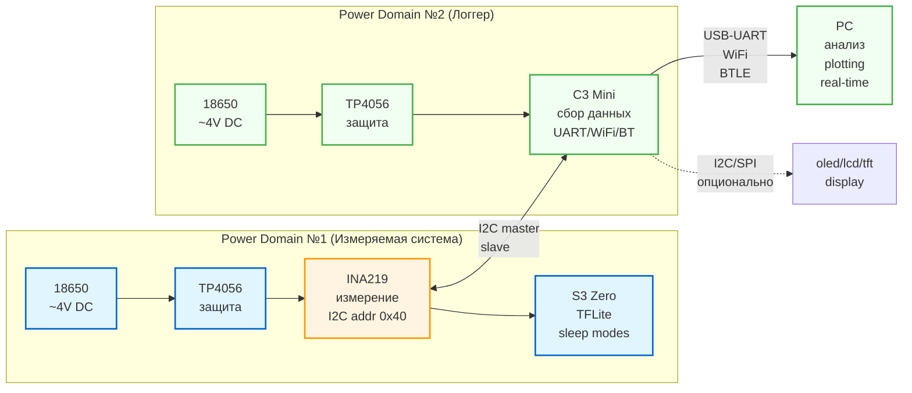

## Зачем этот репозиторий

Пишу диплом бакалавриата. Тема: "Разработка энергоэффективной системы
распознавания речи с использованием нейронных сетей для IoT-устройств".

Для создания энергоэффективной системы применяется технология edge devices - ...

## Система

Для прототипа системы я выбрал чип esp32-s3 от компании Espressif. Почему именно
его? Потому что:

- векторные инструкции для нейронок (SIMD - Single instruction, Multiple Data -
  за одну инструкцию можно сразу много чиселок перемножать => быстрее инференс)
- LX7 крутая быстрая архитектура, RISC-V хайп
- есть wifi, btle и основная периферия, что соответствует IoT-устройству
- есть несколько уровней энергосбережения - стандартный и глубокий сон. Можно
  отключать ЦПУ и ждать команды, чтобы потом просыпаться по какой-нибудь
  команде, аля "Алиса", выполнять свою задачу, и засыпать обратно. Так можно
  жить от одной батарейки без подзарядки продолжительное время.
- Есть ESP-DL фреймворк с уже натренированными модельками специально для этой
  архитектуры

## Прототип v1.0

