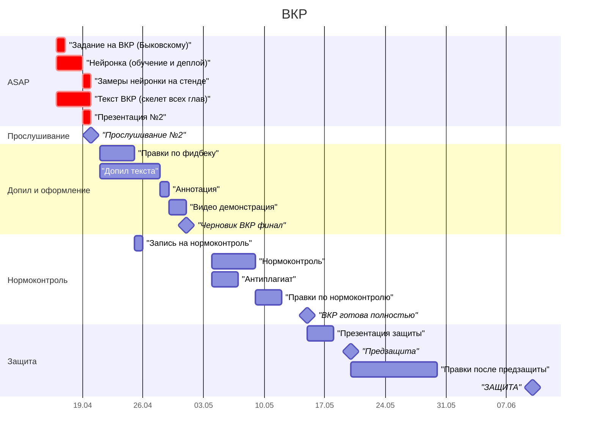

# TODO — ВКР "Энергоэффективная система распознавания речи на ESP32-S3"

**Научрук:** Быковский С.В.  
**Главный дедлайн:** 19 апреля 23:59 — скелет ВКР done, отправлен Быковскому  
**Защита:** июнь 2026

---

---

## 1. ЗАДАНИЕ НА ВКР

**Дедлайн: отправить Быковскому — 17 апреля вечер**

- [ ] Скопировать из roadmap черновик ТЗ в отдельный файл `docs/vkr_zadanie.md`
- [ ] Прочитать, убрать косяки, подогнать под свою реальность
- [ ] Написать сообщение Быковскому в ТГ/почту с черновиком
- [ ] Отправить
- [ ] Получить фидбек → внести правки
- [ ] Загрузить в систему ИТМО (дедлайн ИТМО: 30 апреля)

---

## 2. NN

**Дедлайн: всё работает и замерено — 19 апреля 23:59**

### 2.1 Training

#### 2.1.1 Сетап (цель: готовая среда для training)

- [x] Создать директорию `nn/` в репозитории
- [x] Настроить Google Colab с T4 GPU
- [x] Скачать Google Speech Commands v2
- [x] Настроить симлинки Drive для персистентности
- [x] Скрипт обновления кода из GitHub без перезагрузки Colab
- [x] **артефакт:** `nn/README.md`, `nn/COLAB_GUIDE.md`

#### 2.1.2 Baseline FP32 (цель: обученная модель и цифра accuracy)

- [x] Реализовать DS-CNN M архитектуру (6 блоков × 172 фильтра, 200K параметров)
  - note: на самом деле сначала сделал S, но для увеличения точности сделал M,
    т.к. на чипе есть 8 MB памяти, а после квантизации и так влезет (чип
    ESP32-S3-zero N8R8).
- [x] MFCC pipeline (49 фреймов × 10 коэффициентов)
- [x] Аугментации: time shift ±100 мс, background noise mixing, SpecAugment
- [x] Предвычисление MFCC (`precompute_mfcc.py`)
  - note: ускорение обучения с 80 мин до 6 мин
- [x] Обучение 50 эпох, Adam + cosine decay LR
- [x] **Результат: test accuracy 96.46%, val 96.06%**
- [x] Сохранить модель в `results/models/ds_cnn_fp32.keras`
- [x] **артефакт:** confusion matrix, training curves, classification report

#### 2.1.3 PTQ INT8 (цель: квантизованная модель + дельта accuracy)

- [x] Квантизация через tf.lite.TFLiteConverter, full INT8, I/O int8
- [x] **Результат: test accuracy 96.15%, drop -0.31 п.п., size 261.7 KB**
- [x] Сохранить `results/models/ds_cnn_ptq_int8.tflite`
- [x] **FIX: silence классифицируется как go (0% recall)**
  - причина: eval использует WAV-based pipeline, silence-файлы не загружаются
  - фикс: переключить eval и representative dataset на `build_dataset_cached`
  - после фикса: перезапустить PTQ
- [x] Перепроверить representative dataset — должен включать все 12 классов
- [x] **артефакт:** строка в `results/comparison.md`

#### 2.1.4 QAT INT8 (цель: QAT модель + дельта accuracy)

- [x] Написать `quantize_qat.py` через tensorflow_model_optimization
- [x] **FIX: tfmot несовместим с Keras 3 (TF 2.19)**
  - причина: tfmot 0.8.0 проверяет isinstance на tf_keras типы
  - фикс: `TF_USE_LEGACY_KERAS=1` + load weights из .weights.h5
  - одноразово: сохранить веса в портабельном формате
- [x] Запустить QAT: 10 эпох fine-tune с fake quantization
- [x] Запустить QAT: 25 эпох fine-tune с fake quantization
- [x] Сконвертировать в TFLite INT8
- [x] Замерить accuracy, сравнить с PTQ и FP32
  - note: с 25 эпохами всё встало на свои места: `fp32>qat>ptq`
- [x] **Результат: test accuracy 96.36%, drop -0.10 п.п., size 261.3 KB**
- [x] Сохранить `results/models/ds_cnn_qat_int8.tflite`
- [x] **артефакт:** confusion matrix, строка в `results/comparison.md`

#### 2.1.5 Экспорт для ESP32

- [x] Запустить `export_to_c.py` — конвертация лучшей .tflite в model_data.cc/h
- [x] Запустить `compare_models.py` — финальная таблица сравнения
- [x] **артефакт:** `results/comparison.md`,
      `results/c_export/model_data.{cc,h}`

### 2.2 Deploy

> Notes
>
> Обучил я DS-CNN нейронку, отлично. Как мне эффективно утилизировать LX7 Xtensa
> архитектуру esp32-s3 и показать красиво это в дипломе? Это ведь SIMD насколько
> я знаю, архитектура параллельных вычислений такая. DS-CNN состоит из depthwise
> свёрток и из pointwise свёрток. Вот pointwise свёртки это вроде просто куча
> умножений матриц, и вот их и можно за счёт SIMD ускорить. Для этого надо
> наверное точно квантизировать модель до INT8, что мы и делали, потому что типа
> с INT8 будет прирост ощутимый, флоаты esp32-s3 наверное не оч быстро считает.
> Потом сделать модель .tflite, и импортировать с ESp-DL, но не шарю. Я читал
> кажется у них в ридми что ESP-DL умеет гарантировать чтоб каждый слой
> использовал векторный ускоритель. А может можно просто нормально было сделать
> TensorFlow Lite Micro и оно само будет работать.
>
> По поводу LX7: насколько я понимаю, LX7 это название ядра которое Espressif
> покупают у другой конторы какой-то китайской. В нём добавлены дополнительные
> регистры размером 128 бит (в отличие от обычных 32-битных регистров в
> процессорах). Это значит, что туда можно положить или 4 числа по 32 бита
> (float/int), или 8 чисел по 16 бит, или 16 чисел по 8 бит (как раз INT8). Вот
> из этого я и сделал вывод про то что INT8 будет практически идеальной в нашей
> ситуации.
>
> То есть, получается что в pointwise свёртках можно будет загонять по 16 int8
> чисел в такие регистры и делать операции умножения одной инструкцией сразу над
> пачкой данных, т.е. в данном случае 16 отдельных умножений весов на данные мы
> сделаем за 1-2 такта.
>
> Дальше я задался вопросом а как вообще в эти широкие регистры данные
> поставляются, если обычно интерконнект системный 32-битный, а вот оказалось
> что espressif расширили шину данных для этого и как-то оптимизировали работу с
> внутренней памятью. хз как.
>
> В общем видимо надо как-то подготовить модель под векторные инструкции LX7,
> рассказать про это в ВКР и на прослушивании. Мб хайп. И подстроить под это
> задачи и всякое такое.
>
> Сейчас в коде квантизации я использую `TFLITE_BUILTINS_INT8`, а это по идее
> как раз если испоьзовать esp-dl, esp-nn или что там надо использовать,
> подхватит эти слов и применит xtensa lx7 SIMD инструкции.

#### 2.2.1 Интеграция с прошивкой ESP32-S3

- [x] Скопировать `model_data.cc/h` в
      `esp32_firmware/components/nn_inference/src/`
- [x] Добавить `espressif/esp-tflite-micro` в `idf_component.yml`
- [x] Проверить что `nn_init()` проходит (AllocateTensors, arena size)
- [x] Интегрировать с I2S pipeline (запись 1с → MFCC → inference)
- [x] Модель загружена, инференс работает (1090ms @ 240MHz INT8)
  - note: сделал `voice_engine` абстракцию с подменой бекендов
    wakenet/custom_kws
- [ ] Проверить MFCC parity: сравнить Python vs C++ выходы поэлементно
  - note: selftest не прогнал, пока работает и норм
- [ ] FP32 tflite деплой для сравнения latency
- [ ] **артефакт:** видео с демонстрацией детекции на устройстве
  - [ ] Добавить дисплей: наглядное отображение состояний FSM
  - [ ] понять как эмбедить видео, какая оптимальная длительность
    - note: 30-40 сек максимум, по 5-10с на каждую сцену
  - [ ] написать сценарий
    - Заснять разные расстояния источника звука / громкости окружений / команды
    - Сбоку на видео подписать:
      - "Расстояние: 30см/1м/2м"
      - "Локация: шумная/тихая"
  - [ ] показать результат Быковскому, спросить обратной связи для предзащиты

#### 2.2.2 Оптимизация под Xtensa LX7 SIMD

- [x] Ускорить cpu до 240 МГц, если будет медленный инференс
- [x] Убедиться что INT8 ops используют векторные инструкции (esp-nn)
  - note: esp-nn компилится и подключается => done
- [ ] Оценить возможность замены float FFT на esp-dsp `dsps_fft2r_fc32`

### 2.3 Measurements

#### 2.3.1 Замеры на устройстве

##### 2.3.1.1 Задержки

- [x] Inference latency INT8: 1090ms @ 240MHz (esp-nn + TFLite Micro)
- [ ] Latency inference: `esp_timer_get_time()` до/после invoke
- [ ] Полноценное профилирование: latency по слоям (MFCC vs inference vs ...)
- [ ] Замерить wake-up time из deep sleep (для раздела об ULP VAD)
- [ ] **артефакт:** таблица latency по слоям

##### 2.3.1.2 Энергопотребление

- [ ] Ток при inference через INA228 (200 Hz sampling)
- [ ] Энергия = U × I_avg × T (в мДж)
- [ ] Сравнить с WakeNet9 (baseline от Espressif)
- [ ] **артефакт:** `results/comparison.md` — финальная таблица

| Модель          | Accuracy | Size (KB) | ESP32-S3 CPU Inference (CPU, ms) | Current (mA) | Energy (mJ) |
| --------------- | -------- | --------- | -------------------------------- | ------------ | ----------- |
| WakeNet9        | —        | —         | —                                | —            | —           |
| DS-CNN fp32     | 96.46%   | 956.0     | —                                |              |             |
| DS-CNN QAT INT8 | 96.29%   | 261.3     | —                                | —            | —           |
| DS-CNN PTQ INT8 | 96.15%   | 261.7     | —                                | —            | —           |

##### 2.3.1.3 Сравнение архитектур DS-CNN (если будет время)

- [ ] Натренировать DS-CNN-S (64 filters, 4 blocks)
- [ ] QAT INT8, деплой, замер inference latency
- [ ] Натренировать DS-CNN-L (276 filters, 5 blocks)
- [ ] QAT INT8, деплой, замер inference latency
- [ ] Итоговая таблица:

| Модель        | Accuracy | Size (KB) | Inference (ms) | Energy (mJ) |
| ------------- | -------- | --------- | -------------- | ----------- |
| DS-CNN-S INT8 | —        | —         | —              | —           |
| DS-CNN-M INT8 | 96.36%   | 261       | 1090           | —           |
| DS-CNN-L INT8 | —        | —         | —              | —           |

> (ds-cnn-s - 64 filters, 4 ds blocks, ~25kb)  
> (ds-cnn-m - 172 filters, 4 ds blocks, ~140kb)  
> (ds-cnn-l - 276 filters, 5 ds blocks, ~420kb)

### (кратко) ВКР

#### Графики и таблицы для текста

- [x] Training curves (loss + accuracy)
- [x] Confusion matrix FP32
- [x] Confusion matrix ds-cnn PTQ INT8
- [x] Confusion matrix QAT INT8
- [x] Scatter plot: accuracy vs model size
  - [x] note: такой себе получился артефакт имхо, не особо репрезентативный
- [ ] Таблица сравнения FP32 / PTQ / QAT
- [ ] Таблица per-class precision / recall / F1

#### Разделы ВКР связанные с нейронкой

- [ ] Обоснование выбора DS-CNN (Hello Edge, MLPerf Tiny)
- [ ] Описание MFCC pipeline с параметрами
- [ ] Описание аугментаций и их влияния
- [ ] Анализ квантизации: PTQ vs QAT, accuracy drop, compression ratio
- [ ] ULP VAD архитектура: deep sleep + пороговый детектор + wake-up time
  - проблема потери начала слова, time shift как частичная компенсация
  - предложение ring buffer на ULP или VM1010 wake-on-sound
- [ ] Xtensa LX7 SIMD: как INT8 квантизация утилизирует 128-бит регистры

---

## 3. СКЕЛЕТ ВКР

**Дедлайн: все главы имеют содержимое — 19 апреля 23:59**

Логика: сначала **буллеты и структура во всех главах**, потом наращиваем текст.
Не пишем главу 1 идеально и потом переходим — пишем скелеты везде, потом
допиливаем.

### 3.1 Структура файла (30 минут)

- [x] Создать `docs/vkr.tex` (или использовать шаблон ИТМО)
- [x] Прописать 4 раздела + введение + заключение + приложения
- [x] Каждый раздел — 2-3 секции заглушки с заголовками

### 3.2 Глава 1. Обзор (цель: 8-12 страниц)

- [ ] 1.1 Актуальность IoT с голосовым управлением — 1 страница
- [ ] 1.2 Keyword Spotting: задача и подходы — 2 страницы
- [ ] 1.3 Архитектуры нейросетей для KWS (DS-CNN, CRNN, TC-ResNet) — 2 страницы
- [ ] 1.4 Методы квантизации (PTQ, QAT, mixed precision) — 2 страницы
- [ ] 1.5 Платформы для edge inference (ESP32-S3, STM32, nRF52) — 1 страница
- [ ] 1.6 Фреймворки (ESP-SR/WakeNet, TFLite Micro, CMSIS-NN) — 1 страница
- [ ] 1.7 Выводы по обзору, постановка задачи — 1 страница

### 3.3 Глава 2. Проектирование (цель: 8-10 страниц)

- [ ] 2.1 Общая архитектура системы (каскадное пробуждение) + диаграмма
- [ ] 2.2 Выбор и обоснование компонентов (ESP32-S3, INMP441, INA228, детектор
      звука)
- [ ] 2.3 Принципиальная схема стенда (два домена питания)
- [ ] 2.4 Архитектура прошивки (модули, FreeRTOS задачи) + UML
- [ ] 2.5 Выбор архитектуры нейросети — обоснование DS-CNN

### 3.4 Глава 3. Реализация (цель: 10-12 страниц)

- [ ] 3.1 Реализация прошивки ESP32-S3 (I2S, WakeNet, deep sleep, ext1 wakeup)
- [ ] 3.2 Обучение DS-CNN (датасет, препроцессинг, гиперпараметры, результаты)
- [ ] 3.3 Квантизация модели (PTQ pipeline, QAT pipeline)
- [ ] 3.4 Деплой через TFLite Micro (memory arena, tensor shapes, интеграция)
- [ ] 3.5 Система логирования (ESP32-C3 + INA228, формат CSV)

### 3.5 Глава 4. Эксперименты (цель: 10-15 страниц)

- [ ] 4.1 Методика измерений (стенд, шина 3.3В, калибровка INA228)
- [ ] 4.2 Декомпозиция энергобюджета (таблица по компонентам)
- [ ] 4.3 Профили потребления по режимам (deep sleep / light sleep /
      inference) + графики
- [ ] 4.4 Сравнение моделей (таблица из 2.6 + интерпретация)
- [ ] 4.5 Расчёт времени автономной работы (несколько сценариев)

### 3.6 Введение (2-3 страницы)

- [ ] Актуальность
- [ ] Цель и задачи (из задания на ВКР)
- [ ] Объект и предмет исследования
- [ ] Практическая значимость
- [ ] Структура работы

### 3.7 Заключение (1-2 страницы)

- [ ] Перечисление выполненных задач
- [ ] Основные результаты (с конкретными цифрами)
- [ ] Направления дальнейшего развития

### 3.8 Оформление (финал)

- [ ] Список источников (15-25 шт) — ГОСТ
- [ ] Список сокращений
- [ ] Приложения (схемы, код, графики)
- [ ] Оглавление, нумерация, форматирование

---

## 4. ПРОСЛУШИВАНИЕ №2

**Дедлайн: 20 апреля**

- [x] Вечер 19 апреля: собрать презентацию из готовых результатов
- [x] Ответ на вопрос про "эффективность" — заменить на конкретные метрики
- [x] Показать реальные цифры из Блока 2.6
- [x] Прогнать доклад на 4-5 минут

---

## 5. ПОСЛЕ 20 АПРЕЛЯ

### 5.0 Ужасы

- [ ] После прослушивания выяснилось что я очень грубо и небрежно сделал обзор
      предметной области. Для edge ai я сделал обзор только лишь ASIC и MCU. Но
      забыл про ПЛИС, DSP, гибридные подходы, ускорители. А ведь действительно
      они могут существенно выигрывать, после небольшого обзора я сам в этом
      убедился. Надо придумать серьёзную защитную линию в эту сторону чтобы
      диплом не просел, придумать чёткое аргументирование (не только
      стоимость/доступность - ещё и что это как из пушки по воробьям мб и моего
      решения хватает и т.п., должно быть много и чётко), чтобы диплом выглядел
      нормально, а не как пет проект запиленный на коленке.

### 5.1 Допил и правки

- [ ] Внести правки по фидбеку Быковского с прослушивания
- [ ] Дописать главы до полноценного объёма
- [ ] Перечитать вслух, поправить косяки стиля

### 5.2 Аннотация

- [ ] Написать аннотацию (тема, объём, ключевые слова, результаты)
- [ ] Загрузить в систему ИТМО

### 5.3 Видео демонстрация

- [ ] Подстроить гейн/порог WakeNet для стабильной детекции
- [ ] Снять видео: система просыпается из deep sleep по звуку → inference →
      реакция
- [ ] Смонтировать короткое видео (1-2 минуты)

### 5.4 Нормоконтроль

- [ ] Узнать на кафедре: кто нормоконтролёр, когда записываться
- [ ] Записаться
- [ ] Пройти проверку
- [ ] Внести правки

### 5.5 Антиплагиат

- [ ] Прогнать через систему ИТМО
- [ ] Переформулировать проблемные участки если есть

### 5.6 Предзащита (20-23 мая)

- [ ] Финальная презентация защиты (10-12 слайдов)
- [ ] Доклад на 7-10 минут
- [ ] Ответы на типовые вопросы комиссии
- [ ] Получить фидбек

### 5.7 Защита (июнь)

- [ ] Отзыв научного руководителя получен
- [ ] Финальная версия ВКР загружена
- [ ] Защита

---

## ЗАМЕТКИ ПО СОДЕРЖАНИЮ

### Энергопотребление — правильная методика

- Измерения на шине 3.3В после стабилизатора (исключаем потери LDO)
- Метрики: Power in Idle (мВт), Energy per Inference (мДж) = U × I_avg ×
  T_inference
- Battery life = E_battery / E_avg_per_cycle — для конкретных сценариев
- Декомпозиция: ток по компонентам (чип из даташита, INMP441, LDO overhead, USB
  PHY)
- Dev board 0.5mA deep sleep → чип 8µA по даташиту → объясняем разницу через
  расчёт для кастомной платы

### Обоснование DS-CNN

- IoT с голосовым управлением → KWS на MCU → нужна компактная модель
- DS-CNN из статьи "Hello Edge" (Zhang et al., 2017), baseline MLPerf Tiny
- Лучший trade-off accuracy/size/latency для MCU класса ESP32
- Датасет: Google Speech Commands v2 — стандартный benchmark

### Обоснование ESP32-S3

- Xtensa LX7 с vector instructions для нейросетей
- WiFi/BLE, PSRAM, low-power modes (deep sleep 8µA)
- Широкая экосистема (ESP-IDF, ESP-SR, TFLite Micro порт)

### Ключевые источники для списка литературы

1. Zhang Y. et al. Hello Edge: Keyword Spotting on Microcontrollers.
   arXiv:1711.07128, 2017.
2. Banbury C. et al. MLPerf Tiny Benchmark. arXiv:2106.07597, 2021.
3. Warden P. Speech Commands: A Dataset for Limited-Vocabulary Speech
   Recognition. arXiv:1804.03209, 2018.
4. David R. et al. TensorFlow Lite Micro. arXiv:2010.08678, 2020.
5. Jacob B. et al. Quantization and Training of NN for Efficient
   Integer-Arithmetic-Only Inference. CVPR, 2018.
6. Lai L. et al. CMSIS-NN: Efficient Neural Network Kernels for Arm Cortex-M.
   arXiv:1801.06601, 2018.
7. Han S. et al. Deep Compression. ICLR, 2016.
8. Espressif Systems. ESP-SR User Guide. docs.espressif.com
9. Espressif Systems. ESP32-S3 Technical Reference Manual.
10. Texas Instruments. INA228 Datasheet.

---

## 📦 АРХИВ (Практика — закрыто)

Practise TODO (all done)

- [x] research: keyword voice detection architectures, energy efficient &
      optimisation methods
- [x] research: mic types - precision vs energy efficiency
- [x] research: power measurement approaches, methods, sensors
- [x] research: cheap available excessive power source for test bench
- [x] research: charger for 18650 power source
- [x] order: inmp441, esp32 s3 zero, ina219, esp32 c3, 2x18650, 2xtp4056, 2xLED,
      pin headers, soldering boards, m4 stands, plexiglass
- [x] research: i2s pipelines, i2s api
- [x] code: setup MEMS i2s mic
- [x] research: partitioning, esp memory layout
- [x] code(s3): make partitions for 1 wakenet model
- [x] code(s3): setup 1 wakenet model, get "Hi, Esp" wakeup word to work
- [x] code(s3): make partitions for 4 wakenet models
- [x] code(s3): setup 4 weakeup models, make them work
- [x] code(s3): blink WS2812B onboard RGB led for each detected wakeup word
- [x] docs: draft practise report
- [x] research: Ohms law, internal 18650's resistance, wires internal
      resistance, Kirhgof's law
- [x] code(c3): i2c bus, INA219 i2c sensor, logging task, get raw data
- [x] verify: ina219 raw data compared to multimeter
- [x] solder: weak joints & all GND to star pattern; thick wires
- [x] research: ULP VAD architecture, ulp types, sleep modes, rtc gpio, ulp
      wakeup
- [x] research: mosfet types
- [x] order: p-channel ao3401 mosfet
- [x] research: analog mic types
- [x] research: rtc gpio capabilities, pin power strengths
- [x] decision: mic power control via rtc gpio (mosfet redundant)
- [x] solder: add red LED to rtc gpio (Sourcing scheme)
- [x] code(s3): go to deep sleep, light green LED using ULP RISC-V
- [x] ulp vad: premade LM393 module — calibrate, verify, solder
- [x] code(s3): ext0 on sound-detection module OUT, wakeup on it
- [x] solder: mount ina228 instead of ina219
- [x] code(c3): setup ina228
- [x] verify: measure power consumption in deep sleep (0.5mA — dev board limit)
- [x] verify: measure voice detection sensor power (1.2mA high / 4.8mA low)
- [x] code(c3): python script to read UART CSV and compose graphs
- [x] measure: active / light sleep / deep sleep
- [x] docs: chapter 3.3, tables, graphs, assembly photos, FSM, UML, circuit
      scheme, BOM
- [x] docs: full practise report written
- [x] docs: technical requirements, shown to Bykovskiy

Robot application (on hold)

- [x] Li-Pol power source + chargers ordered, assembled, verified
- [ ] assemble: once testing ready, assemble inmp441 & ULP VAD components
- [ ] code: uart protocol for directional commands

