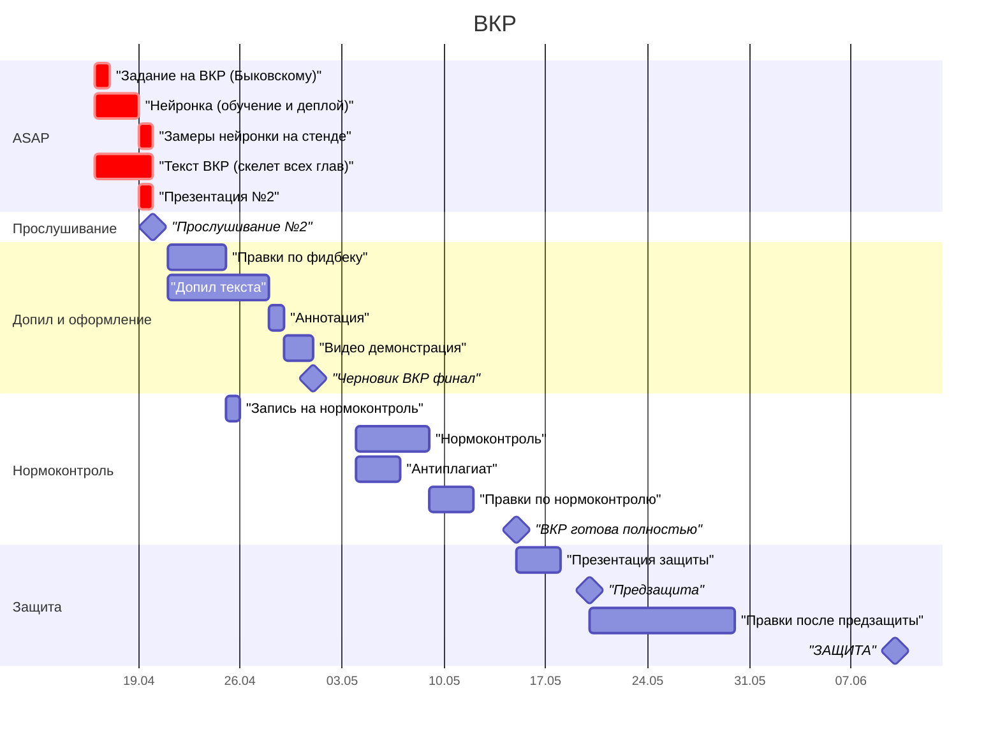

# TODO — ВКР "Энергоэффективная система распознавания речи на ESP32-S3"

**Научрук:** Быковский С.В.  
**Главный дедлайн:** 19 апреля 23:59 — скелет ВКР done, отправлен Быковскому  
**Защита:** июнь 2026

---

---

## 1. ЗАДАНИЕ НА ВКР

**Дедлайн: отправить Быковскому — 17 апреля вечер**

- [ ] Скопировать из roadmap черновик ТЗ в отдельный файл `docs/vkr_zadanie.md`
- [ ] Прочитать, убрать косяки, подогнать под свою реальность
- [ ] Написать сообщение Быковскому в ТГ/почту с черновиком
- [ ] Отправить
- [ ] Получить фидбек → внести правки
- [ ] Загрузить в систему ИТМО (дедлайн ИТМО: 30 апреля)

---

## 2. NN

**Дедлайн: всё работает и замерено — 19 апреля 23:59**

### Training

#### 2.1 Сетап (цель: готовая среда для training)

- [x] Создать директорию `nn/` в репозитории edge-ai-voice-recognition
- [x] `python -m venv venv` + активация
- [x] `pip install tensorflow tensorflow-model-optimization numpy matplotlib`
- [x] Скачать Google Speech Commands v2 (2.3GB):
      `wget http://download.tensorflow.org/data/speech_commands_v0.02.tar.gz`
- [x] Распаковать в `nn/data/`
- [x] Проверить что GPU видится (если есть) или CPU работает
  - note: на ноуте только встройка, так что мы на cpu. Вышло долго, идём на
    google collab
- [x] **артефакт:** `nn/README.md` с инструкцией воспроизведения

#### 2.2 Baseline FP32 (цель: обученная модель и цифра accuracy)

- [x] Взять готовый скрипт обучения DS-CNN из MLPerf Tiny или TF Simple Audio
      tutorial
- [x] Адаптировать под 10 команд (yes, no, up, down, left, right, on, off, stop,
      go)
- [x] сделать `colab_train.ipynb` чтобы там тренировать модель на T4 GPU
- [x] добавить в train.py автосохранение в drive после обучения чтоб не забыть,
      или напоминалку просто
- [x] Добавить код для загрузки директории на гугл коллаб, установки
      зависимостей и проверки GPU устройства на гугл коллабе через tf
- [x] Запустить обучение (на google collab!)
- [ ] Зафиксировать test accuracy
- [ ] Сохранить модель в `nn/models/ds_cnn_fp32.keras`
- [ ] **артефакт:** `nn/results/baseline.txt` с accuracy и размером

#### 2.3 PTQ INT8 (цель: квантизованная модель + дельта accuracy)

- [x] Написать скрипт `nn/quantize_ptq.py` (20 строк через
      tf.lite.TFLiteConverter)
- [ ] Подготовить representative dataset (100 примеров из train)
- [ ] Прогнать квантизацию
- [ ] Замерить accuracy на test после квантизации
- [ ] Сохранить `nn/models/ds_cnn_ptq_int8.tflite`
- [ ] **артефакт:** строка в `nn/results/comparison.md` — PTQ: accuracy, size

#### 2.4 QAT INT8 (цель: QAT модель + дельта accuracy)

- [x] Написать скрипт `nn/quantize_qat.py` через tensorflow_model_optimization
- [ ] Дообучить модель 5-10 эпох с fake quantization
- [ ] Сконвертировать в TFLite INT8
- [ ] Замерить accuracy
- [ ] Сохранить `nn/models/ds_cnn_qat_int8.tflite`
- [ ] **артефакт:** строка в `nn/results/comparison.md` — QAT: accuracy, size

### Deploy

#### Интеграция с прошивкой на ESP32-S3 (цель: inference на устройстве)

- [ ] Создать ветку `tflite-micro` в прошивке
- [ ] Добавить компонент tflite-micro в `idf_component.yml`
- [ ] Конвертировать `.tflite` в C-array:
      `xxd -i ds_cnn_qat_int8.tflite > model_data.cc`
- [ ] Написать `nn_inference.c` — инициализация интерпретатора, буферы, invoke
- [ ] Интегрировать с существующим I2S pipeline (MFCC → model input)
- [ ] Flash на ESP32-S3, посмотреть логи inference
- [ ] Проверить что детектит хотя бы одно слово
- [ ] **артефакт:** видео с телефона — "yes"/"no" детектится на устройстве

### Measurements

#### Первичные замеры (цель: таблица сравнения)

- [ ] Замерить латентность inference (esp_timer между начало/конец invoke)
- [ ] Замерить ток при inference через INA228 (200Hz sampling)
- [ ] Энергия на inference = U × I_avg × T (посчитать в mJ)
- [ ] Повторить для WakeNet9 (уже есть, просто перемерить)
- [ ] **артефакт:** `nn/results/comparison.md` — финальная таблица: | Модель |
      Accuracy | Size | Latency | Current | Energy/inference |
      |--------|----------|------|---------|---------|------------------| |
      WakeNet9 | - | - | - | - | - | | DS-CNN PTQ | - | - | - | - | - | | DS-CNN
      QAT | - | - | - | - | - |

---

## 3. СКЕЛЕТ ВКР

**Дедлайн: все главы имеют содержимое — 19 апреля 23:59**

Логика: сначала **буллеты и структура во всех главах**, потом наращиваем текст.
Не пишем главу 1 идеально и потом переходим — пишем скелеты везде, потом
допиливаем.

### 3.1 Структура файла (30 минут)

- [ ] Создать `docs/vkr.tex` (или использовать шаблон ИТМО)
- [ ] Прописать 4 главы + введение + заключение + приложения
- [ ] Каждая глава — 2-3 секции заглушки с заголовками

### 3.2 Глава 1. Обзор (цель: 8-12 страниц)

- [ ] 1.1 Актуальность IoT с голосовым управлением — 1 страница
- [ ] 1.2 Keyword Spotting: задача и подходы — 2 страницы
- [ ] 1.3 Архитектуры нейросетей для KWS (DS-CNN, CRNN, TC-ResNet) — 2 страницы
- [ ] 1.4 Методы квантизации (PTQ, QAT, mixed precision) — 2 страницы
- [ ] 1.5 Платформы для edge inference (ESP32-S3, STM32, nRF52) — 1 страница
- [ ] 1.6 Фреймворки (ESP-SR/WakeNet, TFLite Micro, CMSIS-NN) — 1 страница
- [ ] 1.7 Выводы по обзору, постановка задачи — 1 страница

### 3.3 Глава 2. Проектирование (цель: 8-10 страниц)

- [ ] 2.1 Общая архитектура системы (каскадное пробуждение) + диаграмма
- [ ] 2.2 Выбор и обоснование компонентов (ESP32-S3, INMP441, INA228, детектор
      звука)
- [ ] 2.3 Принципиальная схема стенда (два домена питания)
- [ ] 2.4 Архитектура прошивки (модули, FreeRTOS задачи) + UML
- [ ] 2.5 Выбор архитектуры нейросети — обоснование DS-CNN

### 3.4 Глава 3. Реализация (цель: 10-12 страниц)

- [ ] 3.1 Реализация прошивки ESP32-S3 (I2S, WakeNet, deep sleep, ext1 wakeup)
- [ ] 3.2 Обучение DS-CNN (датасет, препроцессинг, гиперпараметры, результаты)
- [ ] 3.3 Квантизация модели (PTQ pipeline, QAT pipeline)
- [ ] 3.4 Деплой через TFLite Micro (memory arena, tensor shapes, интеграция)
- [ ] 3.5 Система логирования (ESP32-C3 + INA228, формат CSV)

### 3.5 Глава 4. Эксперименты (цель: 10-15 страниц)

- [ ] 4.1 Методика измерений (стенд, шина 3.3В, калибровка INA228)
- [ ] 4.2 Декомпозиция энергобюджета (таблица по компонентам)
- [ ] 4.3 Профили потребления по режимам (deep sleep / light sleep /
      inference) + графики
- [ ] 4.4 Сравнение моделей (таблица из 2.6 + интерпретация)
- [ ] 4.5 Расчёт времени автономной работы (несколько сценариев)

### 3.6 Введение (2-3 страницы)

- [ ] Актуальность
- [ ] Цель и задачи (из задания на ВКР)
- [ ] Объект и предмет исследования
- [ ] Практическая значимость
- [ ] Структура работы

### 3.7 Заключение (1-2 страницы)

- [ ] Перечисление выполненных задач
- [ ] Основные результаты (с конкретными цифрами)
- [ ] Направления дальнейшего развития

### 3.8 Оформление (финал)

- [ ] Список источников (15-25 шт) — ГОСТ
- [ ] Список сокращений
- [ ] Приложения (схемы, код, графики)
- [ ] Оглавление, нумерация, форматирование

---

## 4. ПРОСЛУШИВАНИЕ №2

**Дедлайн: 20 апреля**

- [ ] Вечер 19 апреля: собрать презентацию из готовых результатов
- [ ] Структура ближе к защите (введение → результаты → выводы)
- [ ] Ответ на вопрос про "эффективность" — заменить на конкретные метрики
- [ ] Показать реальные цифры из Блока 2.6
- [ ] Прогнать доклад на 7-10 минут

---

## 5. ПОСЛЕ 20 АПРЕЛЯ

### 5.1 Допил и правки

- [ ] Внести правки по фидбеку Быковского с прослушивания
- [ ] Дописать главы до полноценного объёма
- [ ] Перечитать вслух, поправить косяки стиля

### 5.2 Аннотация

- [ ] Написать аннотацию (тема, объём, ключевые слова, результаты)
- [ ] Загрузить в систему ИТМО

### 5.3 Видео демонстрация

- [ ] Подстроить гейн/порог WakeNet для стабильной детекции
- [ ] Снять видео: система просыпается из deep sleep по звуку → inference →
      реакция
- [ ] Смонтировать короткое видео (1-2 минуты)

### 5.4 Нормоконтроль

- [ ] Узнать на кафедре: кто нормоконтролёр, когда записываться
- [ ] Записаться
- [ ] Пройти проверку
- [ ] Внести правки

### 5.5 Антиплагиат

- [ ] Прогнать через систему ИТМО
- [ ] Переформулировать проблемные участки если есть

### 5.6 Предзащита (20-23 мая)

- [ ] Финальная презентация защиты (10-12 слайдов)
- [ ] Доклад на 7-10 минут
- [ ] Ответы на типовые вопросы комиссии
- [ ] Получить фидбек

### 5.7 Защита (июнь)

- [ ] Отзыв научного руководителя получен
- [ ] Финальная версия ВКР загружена
- [ ] Защита

---

## ЗАМЕТКИ ПО СОДЕРЖАНИЮ

### Энергопотребление — правильная методика

- Измерения на шине 3.3В после стабилизатора (исключаем потери LDO)
- Метрики: Power in Idle (мВт), Energy per Inference (мДж) = U × I_avg ×
  T_inference
- Battery life = E_battery / E_avg_per_cycle — для конкретных сценариев
- Декомпозиция: ток по компонентам (чип из даташита, INMP441, LDO overhead, USB
  PHY)
- Dev board 0.5mA deep sleep → чип 8µA по даташиту → объясняем разницу через
  расчёт для кастомной платы

### Обоснование DS-CNN

- IoT с голосовым управлением → KWS на MCU → нужна компактная модель
- DS-CNN из статьи "Hello Edge" (Zhang et al., 2017), baseline MLPerf Tiny
- Лучший trade-off accuracy/size/latency для MCU класса ESP32
- Датасет: Google Speech Commands v2 — стандартный benchmark

### Обоснование ESP32-S3

- Xtensa LX7 с vector instructions для нейросетей
- WiFi/BLE, PSRAM, low-power modes (deep sleep 8µA)
- Широкая экосистема (ESP-IDF, ESP-SR, TFLite Micro порт)

### Ключевые источники для списка литературы

1. Zhang Y. et al. Hello Edge: Keyword Spotting on Microcontrollers.
   arXiv:1711.07128, 2017.
2. Banbury C. et al. MLPerf Tiny Benchmark. arXiv:2106.07597, 2021.
3. Warden P. Speech Commands: A Dataset for Limited-Vocabulary Speech
   Recognition. arXiv:1804.03209, 2018.
4. David R. et al. TensorFlow Lite Micro. arXiv:2010.08678, 2020.
5. Jacob B. et al. Quantization and Training of NN for Efficient
   Integer-Arithmetic-Only Inference. CVPR, 2018.
6. Lai L. et al. CMSIS-NN: Efficient Neural Network Kernels for Arm Cortex-M.
   arXiv:1801.06601, 2018.
7. Han S. et al. Deep Compression. ICLR, 2016.
8. Espressif Systems. ESP-SR User Guide. docs.espressif.com
9. Espressif Systems. ESP32-S3 Technical Reference Manual.
10. Texas Instruments. INA228 Datasheet.

---

## 📦 АРХИВ (Практика — закрыто)

Practise TODO (all done)

- [x] research: keyword voice detection architectures, energy efficient &
      optimisation methods
- [x] research: mic types - precision vs energy efficiency
- [x] research: power measurement approaches, methods, sensors
- [x] research: cheap available excessive power source for test bench
- [x] research: charger for 18650 power source
- [x] order: inmp441, esp32 s3 zero, ina219, esp32 c3, 2x18650, 2xtp4056, 2xLED,
      pin headers, soldering boards, m4 stands, plexiglass
- [x] research: i2s pipelines, i2s api
- [x] code: setup MEMS i2s mic
- [x] research: partitioning, esp memory layout
- [x] code(s3): make partitions for 1 wakenet model
- [x] code(s3): setup 1 wakenet model, get "Hi, Esp" wakeup word to work
- [x] code(s3): make partitions for 4 wakenet models
- [x] code(s3): setup 4 weakeup models, make them work
- [x] code(s3): blink WS2812B onboard RGB led for each detected wakeup word
- [x] docs: draft practise report
- [x] research: Ohms law, internal 18650's resistance, wires internal
      resistance, Kirhgof's law
- [x] code(c3): i2c bus, INA219 i2c sensor, logging task, get raw data
- [x] verify: ina219 raw data compared to multimeter
- [x] solder: weak joints & all GND to star pattern; thick wires
- [x] research: ULP VAD architecture, ulp types, sleep modes, rtc gpio, ulp
      wakeup
- [x] research: mosfet types
- [x] order: p-channel ao3401 mosfet
- [x] research: analog mic types
- [x] research: rtc gpio capabilities, pin power strengths
- [x] decision: mic power control via rtc gpio (mosfet redundant)
- [x] solder: add red LED to rtc gpio (Sourcing scheme)
- [x] code(s3): go to deep sleep, light green LED using ULP RISC-V
- [x] ulp vad: premade LM393 module — calibrate, verify, solder
- [x] code(s3): ext0 on sound-detection module OUT, wakeup on it
- [x] solder: mount ina228 instead of ina219
- [x] code(c3): setup ina228
- [x] verify: measure power consumption in deep sleep (0.5mA — dev board limit)
- [x] verify: measure voice detection sensor power (1.2mA high / 4.8mA low)
- [x] code(c3): python script to read UART CSV and compose graphs
- [x] measure: active / light sleep / deep sleep
- [x] docs: chapter 3.3, tables, graphs, assembly photos, FSM, UML, circuit
      scheme, BOM
- [x] docs: full practise report written
- [x] docs: technical requirements, shown to Bykovskiy

Robot application (on hold)

- [x] Li-Pol power source + chargers ordered, assembled, verified
- [ ] assemble: once testing ready, assemble inmp441 & ULP VAD components
- [ ] code: uart protocol for directional commands

